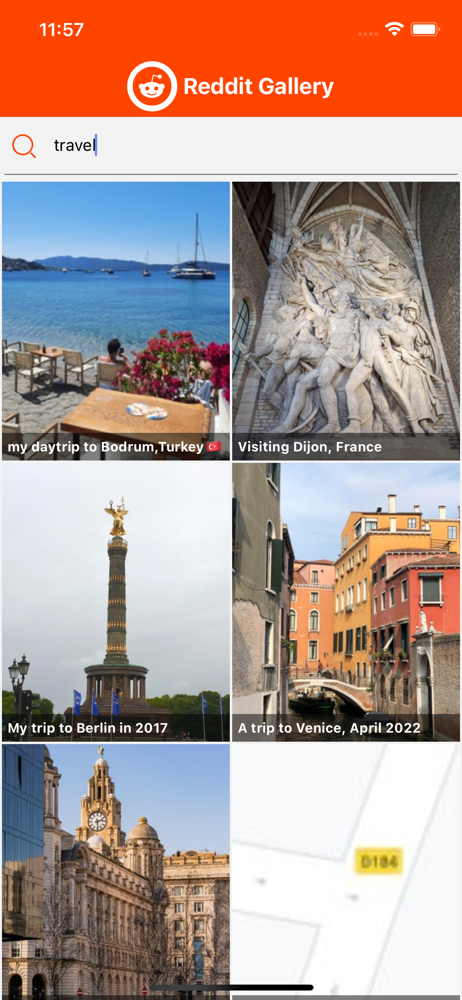
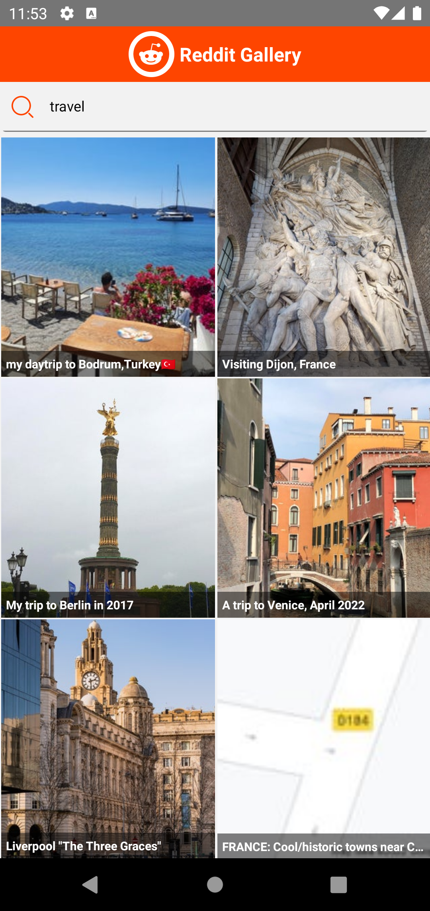

  
  

    <h3>
      <b>
        Reddit Gallery
      </b>
    </h3>
  

   

# Browse Reddit in gallery mode

#### Information

- Type the username you want and see the posts of the user listed on the top.
- Go to the detail of the mail.
- Find out how to use redux and redux-saga in this project.
- The application has been made enjoyable to use with various animations.
- It was coded with fully functional component.

## **Features**
|  iOS Gif |  Android Gif | iOS  | Android  |
|---|---|---|---|
|   |   |   |   |
|  You can search. | You can review the details of any post. | You can use it on iOS.  | You can use it on Android.  |

